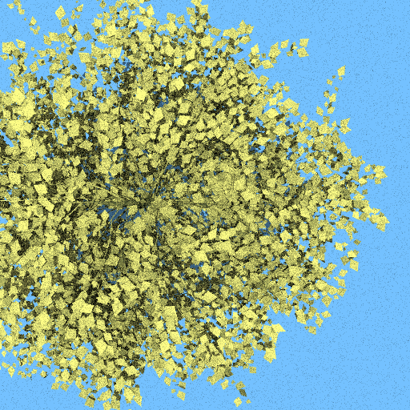

  

# librat tutorial

Librat is a freeware Monte Carlo Ray Tracing code, developed at UCL Geography. The code Copyright is held by UCL (Prof. P. Lewis and Dr. M. Disney), but is provided free of charge and unsupported for non-commercial use. For commercial use please contact Prof. P. Lewis.

This set of Jupyter notebooks will take you through installation, running a few simple simulations, adding trees to the scene and then more complex multispectral and lidar simulations. If you need to install librat the refer to notebook 1.1.

If you have any questions regarding these tutorials pleaase contact <a href=mailto:p.wilkes@ucl.ac.uk>Phil Wilkes</a> (UCL)

